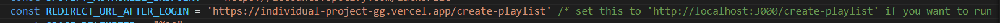

# Generasi Gigih Final Project

My final project submission for GenerasiGIGIH. This app consume Spotify API to create a playlist in your Spotify account.

## Screenshots


## Features

- 🎵 Of course, you can **create a playlists**
- 🎶 You can search any song that you want
- 🧑 You can see your profile (only Profile Pic & Display Name)

## Powered by

- [Create React App](https://create-react-app.dev/) to initialize the project.
- [TypeScript 💎](https://typescriptlang.org).
- [React Redux](https://react-redux.js.org/) to manage the app state.
- [Jest](https://jestjs.io/) & [react testing-library](https://testing-library.com/).
- Hosted on [Vercel 🚀](https://vercel.com/).

## Environment Variables

- `REACT_APP_SPOTIFY_CLIENT_ID` that contains Spotify Client ID

## Run on Local

- Clone the project

  ```bash
    git clone https://github.com/IrsyadRA/individual-project-gg
  ```

- Go to the project directory

  ```bash
    cd individual-project-gg
  ```

- Install dependencies

  ```bash
    yarn/npm
  ```

- Set up the [environment variables](#environment-variables)

- You need to set redirect URL on /src/pages/login_pages/index.js (I already add comment for Redirect URL).
<center></center>

- Start the server

  ```bash
    yarn/npm start
  ```

- Open http://localhost:3000 with your browser to see the result.
